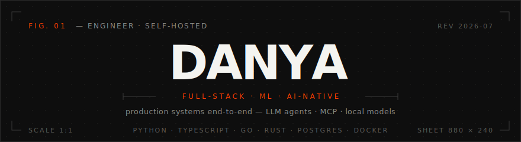
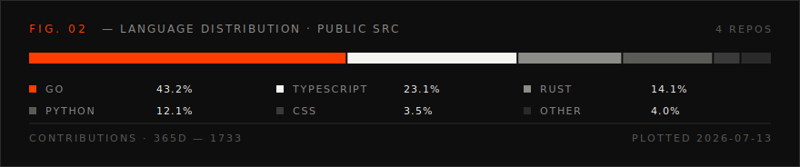

#### `WHOAMI`

Full-stack & ML engineer. I build production systems end-to-end — backend, frontend, and the infrastructure under them — and I work AI-native: LLM agents, MCP tooling, local models.

#### `STACK`

#### `FEATURED`

| repo | what it is | stack | status |
|------|------------|-------|--------|
| [**tenebra**](https://github.com/Divaaaan/tenebra) | cross-platform VPN client on sing-box — stdlib-only core, honest leak-check, CI with race detector + e2e | `Go` · `Tauri` · `React` | `pre-release` |
| [**Dota AI Coach**](https://github.com/Divaaaan/proj_d) | real-time coaching over Valve's official GSI — deterministic rule engine + LLM advice on a transparent overlay | `Python` · `FastAPI` · `Electron` | `early` |

#### `CURRENTLY`

- **applied ML** — demand forecasting on the Nixtla stack: demand classification, conformal prediction intervals, hierarchical reconciliation, honest leak-free backtesting
- **LLM tooling** — real-time agents, MCP integrations, local-model pipelines

#### `SIGNALS`

#### `CONTACT`

